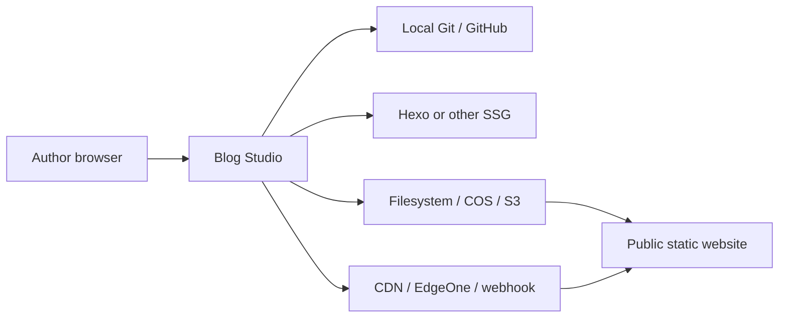
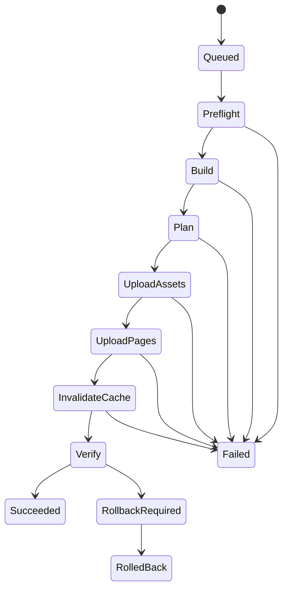

# Architecture Overview

## Requirements summary

### Functional

- Manage multiple configured file-based site workspaces.
- Discover and edit generator-specific content through a generic contract.
- Keep drafts independent from Git commits and production releases.
- Store assets through replaceable providers with article-scoped keys.
- run the real site generator for preview and production builds.
- Execute observable, retryable, and reversible releases.
- Support self-hosting behind a reverse proxy.

### Non-functional

- Single-node availability target: 99%; public-site availability is independent.
- Draft RPO: 0 after an acknowledged autosave; local recovery RTO: 15 minutes.
- API latency: below 200 ms p95 for non-build endpoints on the reference server.
- No provider credential may be sent to the browser unless it is temporary,
  scoped, and explicitly required for direct upload.
- Only one release may mutate a workspace/target pair at a time.
- A clean Docker Compose installation should take less than 10 minutes.
- Core packages must be testable without network, GitHub, COS, or Hexo.

## System context



The public site has no request-time dependency on Blog Studio.

## Architecture style

Blog Studio is a modular monolith. The application and background job runner
ship as one deployable image in v0.1, while package boundaries enforce adapter
and domain separation. SQLite stores operational state. Each managed site lives
in an isolated working directory.

Microservices, Redis, and PostgreSQL are deliberately excluded until measured
concurrency or availability requirements justify them.

## Modules

### Studio Web

- workspace dashboard and setup wizard;
- document list, filters, and editor;
- source/visual mode and preview pane;
- asset library scoped by workspace/document;
- release timeline, diagnostics, and rollback controls.

### Core application

- workspace configuration and capability negotiation;
- document and front-matter application services;
- draft snapshots and optimistic revision checks;
- asset policy and provider routing;
- preview lifecycle;
- release planning and state machine.

### Adapter host

Loads built-in adapters from explicit configuration. Third-party JavaScript
loading is postponed; v0.1 offers a typed package SDK and generic command
adapter. This avoids executing arbitrary plugins in the server process before a
permission and isolation model exists.

### Job runner

Executes builds, uploads, cache operations, and verification. Jobs are persisted
before execution and have structured stages, logs, cancellation signals, and
idempotency keys. SQLite leasing prevents duplicate execution after restart.

## Core contracts

```ts
export interface GeneratorAdapter {
  readonly id: string;
  detect(context: DetectContext): Promise<DetectionResult>;
  inspect(context: WorkspaceContext): Promise<SiteModel>;
  readDocument(ref: DocumentRef): Promise<DocumentSource>;
  writeDocument(input: WriteDocumentInput): Promise<WriteResult>;
  resolvePublicUrl(ref: DocumentRef): Promise<string>;
  build(input: BuildInput): Promise<BuildResult>;
}

export interface AssetProvider {
  readonly id: string;
  put(input: AssetPutInput): Promise<AssetRecord>;
  list(scope: AssetScope): Promise<AssetRecord[]>;
  delete(input: AssetDeleteInput): Promise<void>;
}

export interface Publisher {
  readonly id: string;
  plan(input: PublishInput): Promise<PublishPlan>;
  apply(plan: PublishPlan, events: PublishEventSink): Promise<PublishResult>;
  rollback(release: ReleaseRecord): Promise<RollbackResult>;
}

export interface CacheProvider {
  readonly id: string;
  invalidate(input: CacheInvalidation): Promise<CacheResult>;
}
```

All inputs and outputs are serializable and validated at package boundaries.

## Data ownership

| Data                    | Source of truth                      | Backup expectation                     |
| ----------------------- | ------------------------------------ | -------------------------------------- |
| Published content       | Git/files                            | remote Git and user backup             |
| Draft snapshots         | SQLite                               | daily application-data backup          |
| Media                   | selected asset provider              | provider versioning/lifecycle policy   |
| Workspace configuration | `blog-studio.yml`                    | Git                                    |
| Secrets                 | server environment or mounted secret | external secret backup                 |
| Releases/jobs           | SQLite                               | useful but not required to render site |

SQLite never stores the canonical published Markdown body.

## Release state machine



Static assets are promoted before HTML. Provider-specific publishing must return
an exact manifest. Deletion is disabled unless the target and key prefix are
explicitly managed by Blog Studio; legacy prefixes are always excluded.

## Configuration sketch

```yaml
version: 1
workspace:
  id: personal-blog
  root: /workspaces/personal-blog
generator:
  adapter: hexo
  options:
    config: _config.yml
content:
  collections:
    posts:
      assetScope: media/posts/{documentId}
repository:
  adapter: local-git
  options:
    remote: origin
assets:
  adapter: tencent-cos
  options:
    publicBaseUrl: https://blog.example.com
    keyPrefix: media/posts
publish:
  adapter: tencent-cos
  options:
    keyPrefix: blog.example.com
cache:
  adapter: tencent-cdn
verification:
  baseUrl: https://blog.example.com
```

Secrets are referenced by environment-variable name rather than stored here.

## Security model

- v0.1 assumes a trusted single-user installation, preferably protected by VPN,
  network ACL, or reverse-proxy authentication.
- Workspaces must resolve beneath an administrator-configured root.
- commands come only from trusted built-in adapters or explicit configuration;
  user-provided shell fragments are not accepted through the browser.
- Build processes receive an allowlisted environment and execution timeout.
- Object-storage credentials are server-side and prefix-scoped.
- Mutating API requests require same-site sessions and CSRF protection.
- Logs redact configured secret values and authorization headers.

## Failure modes

| Failure                     | User impact          | Mitigation                                                |
| --------------------------- | -------------------- | --------------------------------------------------------- |
| Studio unavailable          | cannot edit/publish  | public site remains available                             |
| Git remote unavailable      | push delayed         | drafts and local commits remain safe                      |
| Generator build fails       | no release           | surface structured log; production unchanged              |
| asset upload fails          | release stops        | immutable uploads may be retried safely                   |
| HTML upload partially fails | release incomplete   | manifest identifies affected keys; rollback pages         |
| cache API fails             | content may be stale | verify with bounded retries, then warn/fail policy        |
| server restarts mid-job     | job interrupted      | persistent stage and lease permit safe recovery           |
| concurrent browser edit     | conflicting draft    | optimistic revision conflict, never last-write-wins       |
| malicious repository        | command execution    | trusted-workspace warning and restricted adapter commands |

## Architecture decisions

### ADR-001: Modular monolith

**Status:** Accepted.

One deployable keeps self-hosting simple. Package boundaries preserve future
extraction. Microservices would increase operational cost without improving the
single-user workload.

### ADR-002: Files and Git remain canonical

**Status:** Accepted.

Published content is never trapped in the application database. This limits
workflow queries but guarantees portability and allows the site to operate when
Blog Studio is absent.

### ADR-003: Hexo is a reference adapter

**Status:** Accepted.

Hexo provides the first end-to-end production integration. Core modules may not
import Hexo packages or assume its directories, front matter, or permalink
rules. Generic contracts and conformance tests are implemented first.

### ADR-004: Real generator preview

**Status:** Accepted.

Blog Studio starts and proxies the configured generator preview rather than
attempting to reproduce theme rendering. Preview startup is slower than a fake
renderer, but correctness is more important and incremental builds amortize it.

### ADR-005: Apache-2.0

**Status:** Accepted.

Apache-2.0 matches the DjangoAILab organization precedent, encourages adapter
adoption, and includes an explicit patent grant. A hosted-service moat is not a
v0.1 requirement.

### ADR-006: Immutable article-scoped assets and read-only legacy paths

**Status:** Accepted.

New uploads use `<managed-prefix>/<document-id>/<sha256>-<name>.webp`. The
document ID gives authors a stable natural grouping while the full content hash
makes retries idempotent and cache-safe. Existing resource paths are resolved
for editing and preview but live under separately configured protected prefixes;
Blog Studio cannot overwrite or delete them. Migration is additive instead of a
flag-day URL rewrite.
